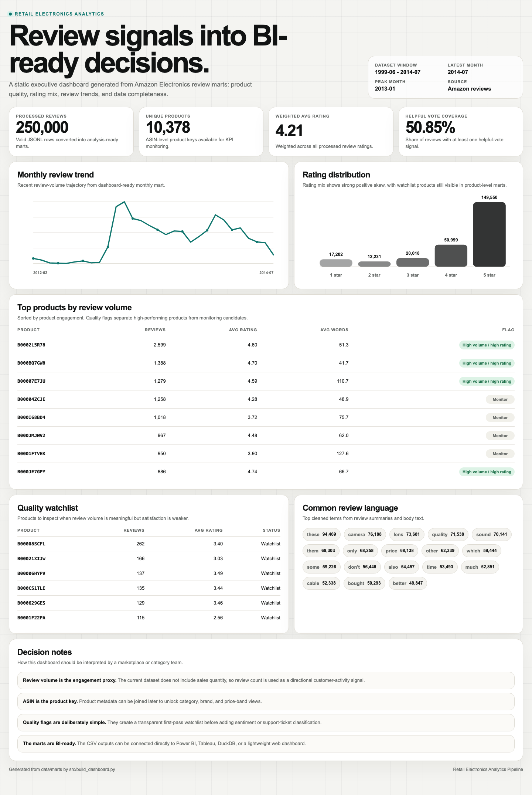

# Retail Electronics Analytics Pipeline

An end-to-end analytics project that transforms raw Amazon Electronics review data into dashboard-ready product, rating, review-volume, and data-quality insights.

This project is designed as a portfolio-grade data analyst / analytics engineering repo: it turns a large raw JSON Lines dataset into reproducible marts, quality checks, and an executive summary that can feed a BI dashboard.

## Business Problem

Marketplace and category teams need a reliable way to monitor electronics product performance from customer review signals. Raw review data is too large and messy for direct stakeholder use, so the goal is to create clean, explainable KPI tables that answer:

- Which products receive the most customer review activity?
- What does the rating distribution look like?
- Which products have high review volume but weak ratings?
- How does review volume change over time?
- Is the dataset complete enough for BI reporting?

## Data Source

The pipeline expects the Amazon Electronics 5-core review dataset as JSON Lines:

```text
Electronics_5.json
```

The raw file is intentionally excluded from Git because it is large. To run the project locally, place it at:

```text
data/raw/Electronics_5.json
```

or pass a custom path:

```bash
python3 -m src.pipeline --input /path/to/Electronics_5.json
```

## Architecture

```text
Raw JSONL reviews
  -> streaming parser
  -> schema checks and field normalization
  -> cleaned review sample
  -> product, monthly, rating, term, and data-quality marts
  -> executive summary and BI-ready outputs
```

The pipeline streams the raw file line by line, so it can process a large dataset without loading the full 1.4GB file into memory.

## Repository Structure

```text
retail-electronics-analytics/
├── data/
│   ├── raw/                 # local-only raw dataset
│   ├── processed/           # cleaned sample output
│   └── marts/               # dashboard-ready KPI tables
├── dashboard/
│   └── screenshots/         # future Power BI/Tableau screenshots
├── notebooks/               # future EDA notebooks
├── reports/
│   ├── data_quality_report.md
│   └── executive_summary.md
├── src/
│   └── pipeline.py
├── Makefile
└── requirements.txt
```

## Outputs

The pipeline writes:

- `data/processed/cleaned_reviews_sample.csv`
- `data/model/fact_reviews.csv`
- `data/model/dim_products.csv`
- `data/model/dim_review_months.csv`
- `data/model/dim_ratings.csv`
- `data/marts/mart_product_performance.csv`
- `data/marts/mart_monthly_review_trends.csv`
- `data/marts/mart_rating_distribution.csv`
- `data/marts/mart_data_quality_summary.csv`
- `data/marts/mart_top_review_terms.csv`
- `reports/data_quality_report.md`
- `reports/executive_summary.md`
- `dashboard/index.html`

## How To Run

From the project root:

```bash
make run RAW=data/raw/Electronics_5.json LIMIT=250000
```

or:

```bash
python3 -m src.pipeline --input data/raw/Electronics_5.json --limit 250000
```

`LIMIT` controls how many valid review rows are processed for the portfolio output. Increase it for deeper analysis.

To export Supabase/Looker-ready model tables:

```bash
make model RAW=data/raw/Electronics_5.json LIMIT=250000
```

To regenerate the static dashboard from the marts:

```bash
make dashboard
```

## Data Model For Excel / BI Tools

The repo includes a simple star schema export for practicing analytics modeling:

```text
fact_reviews
dim_products
dim_review_months
dim_ratings
```

To build the model tables:

```bash
make model RAW=data/raw/Electronics_5.json LIMIT=250000
```

To export a portable Excel workbook:

```bash
make excel
```

The model-only workbook is written to:

```text
reports/retail_electronics_model.xlsx
```

The modeled CSV fact table contains the configured `LIMIT` rows. The Excel workbook includes the first 100,000 fact rows by default so it stays practical to open and inspect locally. Dashboard design is handled in Looker Studio or the static HTML preview, not inside the workbook.

See [docs/excel_model_workflow.md](docs/excel_model_workflow.md) for the step-by-step workflow.

## Dashboard Preview

The repo includes a self-contained HTML dashboard asset:

```text
dashboard/index.html
```

[Open the hosted dashboard demo](https://tin-luong-portfolio.netlify.app/demos/retail-electronics/). Its global filters update every KPI, chart, product table, watchlist, and selection summary from the same subset of 250,000 reviews. Filter by month, rating, ASIN, review volume, or quality flag.

Open it directly in a browser to capture screenshots for GitHub, LinkedIn, or the portfolio website. The dashboard is generated from `data/marts/*.csv` and includes:

- executive KPI cards
- monthly review-volume trend
- rating distribution chart
- top product performance table
- quality watchlist
- common review-language chips
- decision notes for marketplace/category teams



## Current KPI Marts

### Product Performance

Product-level table keyed by `asin`:

- review count
- average rating
- helpful vote volume
- helpful rate
- average review length
- first and last review month
- quality flag

### Monthly Review Trends

Month-level review activity:

- review count
- average rating
- helpful vote volume

### Rating Distribution

Rating mix:

- rating
- review count
- review share

### Data Quality Summary

Dataset health checks:

- valid rows
- invalid JSON rows
- missing required fields
- review text completeness
- helpful vote coverage
- review date window

## Portfolio Positioning

This project demonstrates:

- streaming ingestion of a large JSONL file
- data cleaning and validation
- dashboard-ready mart design
- KPI and quality flag creation
- stakeholder-facing executive reporting
- clear documentation and reproducible local execution

## Limitations

- The review dataset does not include product category, brand, price, or product title metadata.
- `asin` is used as the product key until metadata is joined.
- Review count is a proxy for engagement, not actual sales volume.
- Sentiment is approximated through ratings and review terms; no NLP sentiment model is included yet.
- The current dashboard folder is prepared for screenshots, but BI visuals are not committed yet.

## Next Steps

- Join product metadata to add category and brand marts.
- Build a Power BI or Tableau dashboard on top of the marts.
- Add anomaly flags for sudden rating drops or review-volume spikes.
- Add DuckDB or SQLite for local analytical querying.
- Add notebook-based EDA with selected visual outputs.
- Add a lightweight sentiment classifier for review text themes.

## Attribution

This project is an original portfolio implementation built around a public Amazon review dataset. Reference repositories were studied for architecture and documentation patterns only; no source code, dashboards, or README prose was copied.
